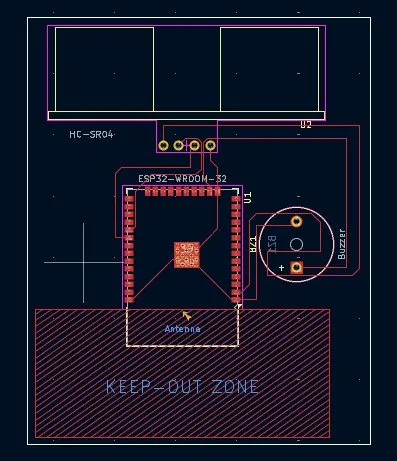
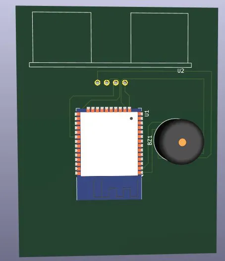
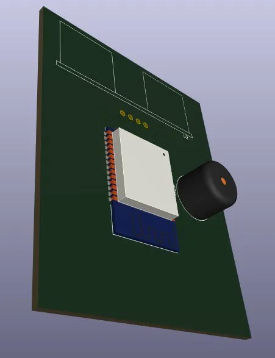

# 04 — ESP32 Proximity Monitor — Custom PCB

Complete PCB design of the ESP32-based proximity monitor from Project 03.
Full layout ready for fabrication including Gerber files.

## Specifications

- **Input:** HC-SR04 Ultrasonic Sensor
- **Output:** Live web dashboard + Buzzer alert
- **Key components:** ESP32-WROOM-32, HC-SR04, Active Buzzer
- **Tools:** KiCad 9
- **Board size:** ~55 x 70 mm
- **Layers:** Single layer (F.Cu)

## Deliverables

- Schematic (inherited from Project 03)
- PCB layout with full routing
- Gerber files ready for fabrication

## PCB Layout

## 3D View

## Fabrication Files

[📁 Gerber Files](gerbers/)
