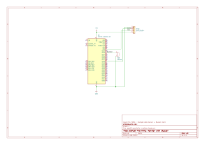

# Andrés Duarte Soza — Electronics Engineer

Electronics Engineer based in Costa Rica, available for remote and local work.  
I design circuits, build PCB schematics, and prototype real hardware from scratch.

---

## What I Can Help You With

- **PCB Schematic Design** — clean, readable schematics using KiCad 9
- **Circuit Design & Analysis** — power supplies, sensor interfaces, microcontroller systems
- **Firmware Development** — Arduino / ESP32 embedded code
- **Prototyping & Testing** — bench validation, multimeter diagnostics, soldering
- **3D Enclosure Modeling** — FreeCAD for custom project housings

---

## Skills

| Area | Tools & Technologies |
|------|----------------------|
| PCB Design | KiCad 9 |
| 3D Modeling | FreeCAD |
| Microcontrollers | Arduino UNO, ESP32 |
| Firmware | Arduino IDE, C/C++ |
| Test & Validation | Multimeter, bench testing, soldering |
| Components | Passive components, voltage regulators, sensors, actuators |

---

## Projects

| # | Project | Type | Tools |
|---|---------|------|-------|
| 01 | 5V Regulated Power Supply | Analog circuit + schematic | KiCad 9 |
| 02 | LED PWM Brightness Control | Microcontroller + schematic | KiCad 9, Arduino IDE |
| 03 | ESP32 Real-Time Proximity Monitor | IoT + web dashboard + schematic | KiCad 9, Arduino IDE |

---

### 01 — 5V Regulated Power Supply

Linear voltage regulator using LM7805. Full-wave bridge rectifier, filter capacitors, and power indicator LED.

- **Input:** 9–12V AC
- **Output:** 5V DC, 1A
- **Key components:** LM7805, 1N4007 x4, 1000µF, 10µF, 100nF
- **Tools:** KiCad 9

---

### 02 — LED PWM Brightness Control

PWM-based LED dimmer controlled by a potentiometer using Arduino UNO.

- **Input:** Potentiometer (10kΩ)
- **Output:** PWM signal to LED
- **Key components:** Arduino UNO, 1N4007, 220Ω, 10kΩ potentiometer
- **Tools:** KiCad 9, Arduino IDE

[▶ Watch demo video](demo-led-pwm.mp4)

---

### 03 — ESP32 Real-Time Proximity Monitor

IoT proximity sensor with live web dashboard. Measures distance using HC-SR04 and serves real-time data via WiFi. Includes audio alert system with proportional beeping.

- **Input:** HC-SR04 Ultrasonic Sensor
- **Output:** Live web dashboard + Buzzer alert
- **Key components:** ESP32, HC-SR04, Active Buzzer
- **Tools:** KiCad 9, Arduino IDE
- **Features:** Color-coded display (green/red), auto-refresh, proportional audio alert

[▶ Watch demo video](esp32-proximity-monitor.mp4)

---

## Contact

- 📧 Email: [andresduartesoza@gmail.com](mailto:andresduartesoza@gmail.com)
- 💻 GitHub: [andresduarte-dev](https://github.com/andresduarte-dev)
- 📍 Location: Costa Rica — available for remote work worldwide
