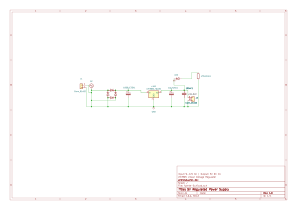
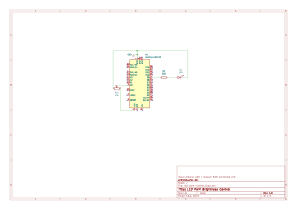

# Andrés Duarte Soza — Electronics Engineer

Electronics Engineer based in Costa Rica, focused on hardware development, PCB design, and building real products from scratch.

## Skills
- PCB Design: KiCad
- 3D Modeling: FreeCAD
- Electronics: circuit design, schematic capture, prototyping
- Tools: multimeter, soldering, bench testing

## Projects

### 01 — 5V Regulated Power Supply
Linear voltage regulator using LM7805. Full-wave bridge rectifier, filter capacitors, and power indicator LED.

- **Input:** 9–12V AC
- **Output:** 5V DC, 1A
- **Key components:** LM7805, 1N4007 x4, 1000µF, 10µF, 100nF
- **Tools:** KiCad 9

### 02 — LED PWM Brightness Control
PWM-based LED dimmer controlled by a potentiometer using Arduino UNO.

- **Input:** Potentiometer (10kΩ)
- **Output:** PWM signal to LED
- **Key components:** Arduino UNO, 1N4007, 220Ω, 10kΩ potentiometer
- **Tools:** KiCad 9, Arduino IDE

[▶ Watch demo video](demo-led-pwm.mp4)

### 03 — ESP32 Real-Time Proximity Monitor
IoT proximity sensor with live web dashboard. Measures distance using HC-SR04 and serves real-time data via WiFi. Includes audio alert system with proportional beeping.

- **Input:** HC-SR04 Ultrasonic Sensor
- **Output:** Live web dashboard + Buzzer alert
- **Key components:** ESP32, HC-SR04, Active Buzzer
- **Tools:** KiCad 9, Arduino IDE
- **Features:** Color-coded display (green/red), auto-refresh, proportional audio alert

[▶ Watch demo video](esp32-proximity-monitor.mp4)

## Contact
- GitHub: [andresduarte-dev](https://github.com/andresduarte-dev)
- Location: Costa Rica
